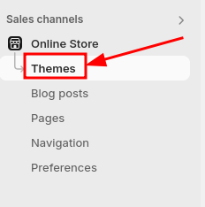
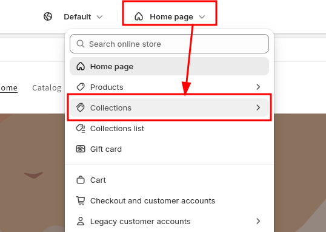
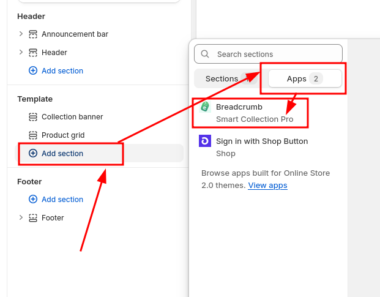
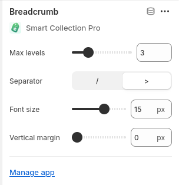
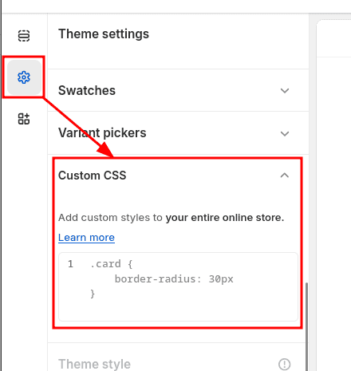

# Breadcrumb Navigation

## Helping Customers Find Their Way

The **Breadcrumb** app blocks add breadcrumb navigation to your store, built from the collection hierarchy you've configured in the app.
They dynamically reflect the parent-child relationships between your collections, giving customers a clear path through your catalog.

Smart Collection Pro provides two breadcrumb blocks:

- **Collection Breadcrumb**: Displays the collection path on collection pages
- **Product Breadcrumb**: Displays the collection path on product pages, linking the product back to its collection

For example, a customer browsing a product might see **Home > Summer Sale > Beachwear > Beach Towel Set**, making it easy to navigate back up through your catalog.

## Adding the Collection Breadcrumb

### How to Enable Breadcrumb Navigation on Collection Pages

#### 1. Open your **Online Store** theme editor



#### 2. In the top bar, select the **Collections** template



#### 3. From the left menu, click **Add section** and select **Breadcrumb** from the **Smart Collection Pro** app



#### 4. Configure the breadcrumb settings from the right menu

You can adjust various settings such as font size, separator style, and spacing directly from the theme editor.



Once added, the breadcrumb navigation will dynamically reflect the collection hierarchy you've configured, making it easier for customers to navigate your store.

---

## Adding the Product Breadcrumb

A **Product Breadcrumb** block is also available for product pages. It works the same way as the collection breadcrumb, but displays the collection path leading to the current product — helping customers understand where the product sits within your catalog and navigate back to the relevant collection.

To add it, follow the same steps as above but select the **Products** template instead of **Collections**, and choose the **Product Breadcrumb** block from the **Smart Collection Pro** app.

### Collection Priority on Product Pages

Because a single product can belong to multiple collections, the breadcrumb needs to pick one to display. By default, the app handles this automatically — but if you want control over which collection appears, you can set up a priority list.

To configure collection priority, open the **Smart Collection Pro** app in your Shopify admin and navigate to the **Breadcrumbs** section from the left menu. From there, you can create an ordered list of collections. Collections at the top of the list take priority.

You don't need to add every collection — if a collection isn't in the list, the app will check whether any of its parent collections are listed and use that priority instead. We recommend keeping the list short and setting priority on top-level collections whenever possible, rather than trying to manage every subcollection individually.

:::tip
Choosing the right collection for your product breadcrumb can help boost the SEO of your Shopify store. The collection linked in the breadcrumb becomes part of the page's structured data and navigation signals, reinforcing the relationship between your products and collections in search engines. Prioritizing your most important collections ensures they receive the strongest SEO benefit.
:::

---

## Structured Data & SEO

Smart Collection Pro automatically adds **structured data** ([JSON-LD](https://developers.google.com/search/docs/appearance/structured-data/breadcrumb)) to your breadcrumb, following Google's recommended format.

This structured data helps search engines understand your store's hierarchy and can result in **breadcrumb-rich results** appearing directly in search engine results pages (SERPs) — giving your Shopify store better visibility and click-through rates.

There's nothing to configure — as soon as you add a breadcrumb block to your theme, the structured data is included automatically.

---

## Advanced Customization

If the built-in configuration options don't meet your needs, you can use custom CSS variables to fine-tune the appearance of your breadcrumbs.

### CSS Selectors

The two breadcrumb blocks use different tag and class selectors:

| Breadcrumb       | Tag selector                      | Container class                        |
| ---------------- | --------------------------------- | -------------------------------------- |
| Collection pages | `smart-collection-pro-breadcrumb` | `.app-block-scp-collection-breadcrumb` |
| Product pages    | `scp-product-breadcrumb`          | `.app-block-scp-product-breadcrumb`    |

Both blocks support the same CSS variables listed below. You can target them individually or style them together.

### How to Add Custom CSS

#### 1. From the theme editor, open **Theme settings** (usually at the bottom of the left sidebar)

#### 2. Scroll down to the **Custom CSS** section



#### 3. Add your custom styles to the text field

**Basic example** — Make the current page label bold and remove underlines from crumb links on both breadcrumbs:

```css
smart-collection-pro-breadcrumb,
scp-product-breadcrumb {
  --scp-bc-current-font-weight: 700;
  --scp-bc-crumbs-text-decoration: none;
}
```

**Advanced example** — Different styles for mobile and desktop using a container query:

```css
/* This is required to get the container query below to work */
.app-block-scp-collection-breadcrumb,
.app-block-scp-product-breadcrumb {
  container-type: inline-size;
  container-name: breadcrumb;
}

/* Desktop style */
smart-collection-pro-breadcrumb,
scp-product-breadcrumb {
  --scp-bc-crumbs-font-size: 1rem;
}

/* Mobile style */
@container breadcrumb (max-width: 750px) {
  smart-collection-pro-breadcrumb,
  scp-product-breadcrumb {
    --scp-bc-crumbs-font-size: 0.85rem;
    --scp-bc-margin-block: 0.5rem;
  }
}
```

#### 4. Click **Save** to apply your changes

Your custom styling will now be applied to the breadcrumbs throughout your store.

### Available CSS Variables

The breadcrumb is made up of several parts: the **prefix** (typically "Home"), one or more **crumb** links, a **last crumb** (the last link before the current page), **separators** between items, and the **current** page label.

The variables follow an inheritance model: **crumbs** styles apply to all items by default, and individual parts (prefix, last crumb, current) inherit from crumbs unless explicitly overridden.

#### Layout

| Variable                | Purpose                                                                                                                                                                 |
| ----------------------- | ----------------------------------------------------------------------------------------------------------------------------------------------------------------------- |
| `--scp-bc-margin-block` | Margin above and below the breadcrumb. Overrides the value from the theme editor settings — best used inside media or container queries for responsive adjustments      |
| `--scp-bc-font-size`    | Base font size for all breadcrumb elements. Overrides the value from the theme editor settings — best used inside media or container queries for responsive adjustments |

:::tip
The **margin-block** and **font-size** overrides are best reserved for targeting specific breakpoints (e.g. mobile vs. desktop) through media or container queries. For general use, it's recommended to keep these driven by the theme editor settings.
:::

#### Separator Styling

Applies only to the separator characters between breadcrumb items (e.g. `/` or `>`).

| Variable                         | Purpose                   | Default                 |
| -------------------------------- | ------------------------- | ----------------------- |
| `--scp-bc-separator-font-size`   | Font size of separators   | Inherits base font size |
| `--scp-bc-separator-font-weight` | Font weight of separators | `400`                   |

#### Crumbs Styling

Applies to **all** breadcrumb items — including the prefix, the last crumb, and the current page label. Each of those can override these values individually using the variables below.

| Variable                          | Purpose                        | Default                 |
| --------------------------------- | ------------------------------ | ----------------------- |
| `--scp-bc-crumbs-font-size`       | Font size of crumb items       | Inherits base font size |
| `--scp-bc-crumbs-text-decoration` | Text decoration of crumb items | `underline`             |
| `--scp-bc-crumbs-font-weight`     | Font weight of crumb items     | `400`                   |

#### Prefix Styling

Overrides crumbs styling for the **root item** only — typically the "Home" link at the start of the breadcrumb.

| Variable                          | Purpose                       | Default              |
| --------------------------------- | ----------------------------- | -------------------- |
| `--scp-bc-prefix-font-size`       | Font size of the prefix       | Inherits from crumbs |
| `--scp-bc-prefix-text-decoration` | Text decoration of the prefix | Inherits from crumbs |
| `--scp-bc-prefix-font-weight`     | Font weight of the prefix     | Inherits from crumbs |

#### Last Crumb Styling

Overrides crumbs styling for the **last link** in the breadcrumb — the final crumb before the current page label.

| Variable                              | Purpose                            | Default              |
| ------------------------------------- | ---------------------------------- | -------------------- |
| `--scp-bc-last-crumb-font-size`       | Font size of the last crumb link   | Inherits from crumbs |
| `--scp-bc-last-crumb-text-decoration` | Text decoration of the last crumb  | Inherits from crumbs |
| `--scp-bc-last-crumb-font-weight`     | Font weight of the last crumb link | Inherits from crumbs |

#### Current Page Styling

Overrides crumbs styling for the **current page** label — the last item in the breadcrumb, which is not a link.

| Variable                       | Purpose                             | Default              |
| ------------------------------ | ----------------------------------- | -------------------- |
| `--scp-bc-current-font-size`   | Font size of the current page label | Inherits from crumbs |
| `--scp-bc-current-font-weight` | Font weight of the current page     | Inherits from crumbs |
