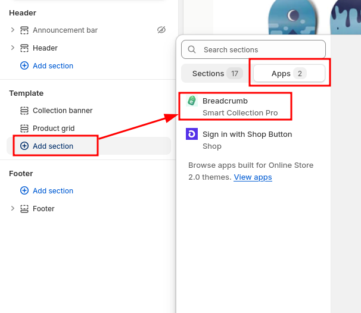

# Breadcrumb Navigation

The app let's you add breadcrumbs to your theme that use the hierarchy you have configured in the app.

## Adding Breadcrumbs to Your Store

After configuring your collection hierarchy in **Smart Collection Pro**, you can enable breadcrumb navigation to improve user experience.

### How to Enable Breadcrumb Navigation

#### 1. Open your **Online Store** theme editor

#### 2. In the top bar, select the **Collections** template

#### 3. From the left menu click **Add section** and from the Apps tab select **Breadcrumb** from **Smart Collection Pro**

#### 4. From the right menu you can **configure the breadcrumb**

Once added, the breadcrumb navigation will dynamically reflect the collection hierarchy you've configured, making it easier for customers to navigate your store.
