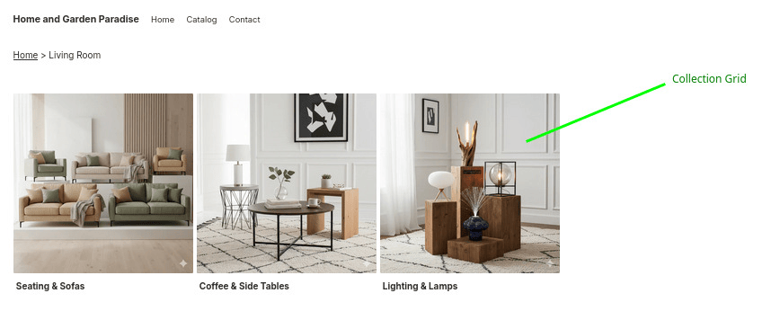
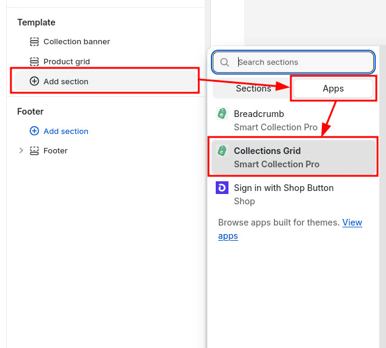
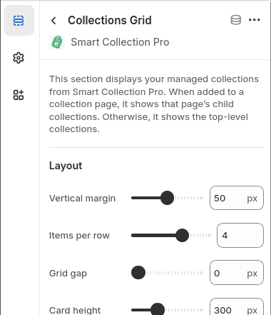

# Collection Grid

## Displaying Collections in Your Store

The **Collection Grid** app block lets you showcase collections in a visually appealing grid layout.
It automatically adapts to your store's context:

- **On collection pages**: Displays child collections (subcollections) of the current collection
- **On other pages**: Shows root-level collections (those without a parent collection)

This is particularly useful when you want to display subcollection images above your product list,
helping customers navigate deeper into your catalog.



## Adding Collection Grid to Your Theme

### How to Enable Collection Grid

#### 1. Open your **Online Store** theme editor


#### 2. Navigate to the page where you want to add the collection grid

- For collection pages, select the **Collections** template from the top bar
- For other pages (like your homepage), navigate to that page


#### 3. From the left menu, click **Add block** or **Add section** and select **Collection Grid** from the **Smart Collection Pro** app



#### 4. Configure the grid settings from the right menu

You can adjust various settings such as spacing, layout, number of columns, and display options directly from the theme editor.



---

## Advanced Customization

If the built-in configuration options don't meet your needs, you can use custom CSS variables to fine-tune the appearance of your collection grid.

### How to Add Custom CSS

#### 1. From the theme editor, open **Theme settings** (usually at the bottom of the left sidebar)

#### 2. Scroll down to the **Custom CSS** section


:::warning

Shopify applies a hard limit of 1,500 characters on Custom CSS.
If you need more than 1,500, it's possible to update the theme's code directly.
Our team can help you achieve this. Feel free to contact us.

:::

#### 3. Add your custom styles to the text field

**Basic example** - Customize title color and padding:

```css
scp-collection-grid {
  --scp-cg-title-color: #342245;
  --scp-cg-title-padding: 2rem;
}
```

**Advanced example** - Different styles for mobile devices:

```css
/* This is required to get the container query below to work */
.app-block-scp-collection-grid {
  container-type: inline-size;
  container-name: collection-grid;
}

/* Desktop style */
scp-collection-grid {
  --scp-cg-title-padding: 1rem;
}

/* Mobile style */
@container collection-grid (max-width: 750px) {
  scp-collection-grid {
    --scp-cg-title-padding: 0;
  }
}
```

#### 4. Click **Save** to apply your changes

Your custom styling will now be applied to the collection grid throughout your store.

### Available CSS Variables

#### Title Styling

| Variable                                  | Purpose                                                                          |
| ----------------------------------------- | -------------------------------------------------------------------------------- |
| `--scp-cg-title-color`                    | Text color of collection titles                                                  |
| `--scp-cg-title-background-color`         | Background color behind titles: adapts to the title width (default: transparent) |
| `--scp-cg-title-wrapper-background-color` | Background color behind titles: fills the whole space horizontally               |
| `--scp-cg-title-padding`                  | Spacing inside the title area                                                    |
| `--scp-cg-title-margin`                   | Spacing around the title area                                                    |
| `--scp-cg-title-border-radius`            | Rounded corners for title background                                             |
| `--scp-cg-title-text-wrap`                | How the title text wraps (e.g. `nowrap`, `balance`)                              |

#### Card Styling

| Variable                              | Purpose                                                      |
| ------------------------------------- | ------------------------------------------------------------ |
| `--scp-cg-background-color`           | Background color of collection cards                         |
| `--scp-cg-padding`                    | Inner spacing of the card (must include a unit, e.g. `10px`) |
| `--scp-cg-border-width`               | Thickness of card border                                     |
| `--scp-cg-border-color`               | Color of card border                                         |
| `--scp-cg-border-style`               | Border style (solid, dashed, etc.)                           |
| `--scp-cg-card-width`                 | Outer width of each card                                     |
| `--scp-cg-card-height`                | Outer height of each card                                    |
| `--scp-cg-thumbnail-object-fit`       | How images fit within their container (cover, contain, etc.) |
| `--scp-cg-thumbnail-background-color` | Background color behind collection images                    |
| `--scp-cg-thumbnail-height`           | Height of the card thumbnail area                            |
| `--scp-cg-thumbnail-display`          | Display mode of the thumbnail (e.g. `none` to hide it)       |
| `--scp-cg-thumbnail-aspect-ratio`     | Aspect ratio applied to thumbnails (e.g. `1 / 1`, `16 / 9`)  |
| `--scp-cg-image-width`                | Width of the image inside the thumbnail                      |

#### Card Inner Layout

Controls the flex container that wraps the card's contents (thumbnail, title, etc.).

| Variable                              | Purpose                                                             |
| ------------------------------------- | ------------------------------------------------------------------- |
| `--scp-cg-card-inner-width`           | Width of the inner content wrapper                                  |
| `--scp-cg-card-inner-height`          | Height of the inner content wrapper                                 |
| `--scp-cg-card-inner-display`         | Display mode of the inner wrapper (default: `flex`)                 |
| `--scp-cg-card-inner-flex-direction`  | Direction of inner content (`column`, `row`, etc.)                  |
| `--scp-cg-card-inner-justify-content` | Main-axis alignment of inner content (`center`, `space-between`, …) |
| `--scp-cg-card-inner-align-items`     | Cross-axis alignment of inner content (`center`, `flex-start`, …)   |

#### Grid & Layout

Controls how cards are arranged on the page.

| Variable                        | Purpose                                                  |
| ------------------------------- | -------------------------------------------------------- |
| `--scp-cg-columns`              | Override the number of columns set in the block settings |
| `--scp-cg-grid-display`         | Display mode for the container (`grid` or `flex`)        |
| `--scp-cg-grid-flex-wrap`       | Wrap behavior when in flex mode (`wrap`, `nowrap`)       |
| `--scp-cg-grid-justify-content` | Horizontal alignment of items inside the container       |
| `--scp-cg-grid-margin-left`     | Left margin applied to the grid                          |
| `--scp-cg-grid-margin-right`    | Right margin applied to the grid                         |

#### Carousel — Navigation Buttons

Used when the block is displayed as a carousel.

| Variable                                    | Purpose                                                                   |
| ------------------------------------------- | ------------------------------------------------------------------------- |
| `--scp-cg-carousel-button-size`             | Diameter of the prev/next buttons (default: `34px`)                       |
| `--scp-cg-carousel-button-background-color` | Fill color of the prev/next buttons (default: `#FFF`)                     |
| `--scp-cg-carousel-button-border-color`     | Border color of the prev/next buttons (default: `#BBB`)                   |
| `--scp-cg-carousel-button-horizontal-offet` | Horizontal offset of the buttons from the carousel edge (default: `10px`) |

> Note: `--scp-cg-carousel-button-horizontal-offet` is intentionally spelled with a single `s` — it must match the variable name used in the theme code.

#### Carousel — Arrows

Controls the chevron icon drawn inside each navigation button.

| Variable                                | Purpose                                              |
| --------------------------------------- | ---------------------------------------------------- |
| `--scp-cg-carousel-arrow-size`          | Length of the arrow chevron (default: `9px`)         |
| `--scp-cg-carousel-arrow-color`         | Color of the arrow (default: `#000`)                 |
| `--scp-cg-carousel-arrow-thickness`     | Thickness of the chevron strokes (default: `2px`)    |
| `--scp-cg-carousel-arrow-bar-thickness` | Thickness of the optional arrow bar (default: `2px`) |
| `--scp-cg-carousel-arrow-bar-width`     | Width of the optional arrow bar (default: `9px`)     |

#### Carousel — Scroll Indicator

The track shown below the carousel that reflects the scroll position.

| Variable                                           | Purpose                                         |
| -------------------------------------------------- | ----------------------------------------------- |
| `--scp-cg-carousel-scroll-indicator-display`       | Show or hide the scroll indicator (e.g. `none`) |
| `--scp-cg-carousel-scroll-indicator-height`        | Height of the indicator track (default: `5px`)  |
| `--scp-cg-carousel-scroll-indicator-background`    | Background color of the track (default: `#DDD`) |
| `--scp-cg-carousel-scroll-indicator-border-radius` | Rounded corners for the track (default: `3px`)  |
| `--scp-cg-carousel-scroll-indicator-margin`        | Spacing around the track (default: `6px 0`)     |

#### Carousel — Scrollbar Thumb

The draggable handle inside the scroll indicator.

| Variable                                 | Purpose                                                                |
| ---------------------------------------- | ---------------------------------------------------------------------- |
| `--scp-cg-carousel-scrollbar-background` | Color of the scrollbar thumb (default: `#777`)                         |
| `--scp-cg-carousel-scrollbar-width`      | Width of the scrollbar thumb (default: `clamp(50px, 15%, 200px)`)      |
| `--scp-cg-carousel-scrollbar-left`       | Left position of the thumb (advanced; usually computed automatically)  |
| `--scp-cg-carousel-scrollbar-right`      | Right position of the thumb (advanced; usually computed automatically) |

#### Carousel — Items

Controls the sizing of each card slide inside the carousel.

| Variable                       | Purpose                                                                           |
| ------------------------------ | --------------------------------------------------------------------------------- |
| `--scp-cg-carousel-item-flex`  | Flex shorthand for each item (controls how slides size to fit `--scp-cg-columns`) |
| `--scp-cg-carousel-item-width` | Explicit width of each carousel item                                              |

:::note

If you need more customization,
our team is happy to understand your requirements and add the necessary options.
Feel free to contact us.

:::
