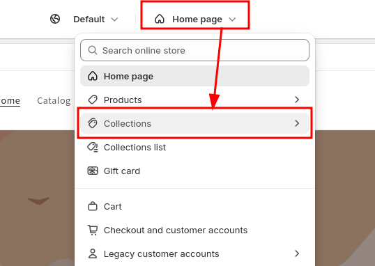

# Collection Grid

## Displaying Collections in Your Store

The **Collection Grid** app block lets you showcase collections in a visually appealing grid layout.
It automatically adapts to your store's context:

- **On collection pages**: Displays child collections (subcollections) of the current collection
- **On other pages**: Shows root-level collections (those without a parent collection)

This is particularly useful when you want to display subcollection images above your product list,
helping customers navigate deeper into your catalog.


## Adding Collection Grid to Your Theme

### How to Enable Collection Grid

#### 1. Open your **Online Store** theme editor


#### 2. Navigate to the page where you want to add the collection grid

- For collection pages, select the **Collections** template from the top bar
- For other pages (like your homepage), navigate to that page



#### 3. From the left menu, click **Add block** or **Add section** and select **Collection Grid** from the **Smart Collection Pro** app


#### 4. Configure the grid settings from the right menu

You can adjust various settings such as spacing, layout, number of columns, and display options directly from the theme editor.


---

## Advanced Customization

If the built-in configuration options don't meet your needs, you can use custom CSS variables to fine-tune the appearance of your collection grid.

### How to Add Custom CSS

#### 1. From the theme editor, open **Theme settings** (usually at the bottom of the left sidebar)

#### 2. Scroll down to the **Custom CSS** section


#### 3. Add your custom styles to the text field

**Basic example** - Customize title color and padding:

```css
scp-collection-grid {
  --scp-cg-title-color: #342245;
  --scp-cg-title-padding: 2rem;
}
```

**Advanced example** - Different styles for mobile devices:

```css
[data-block-handle='collections-grid'] {
  container-type: inline-size;
  container-name: collection-grid;
}

@container collection-grid (max-width: 750px) {
  scp-collection-grid {
    --scp-cg-title-padding: 0;
    --scp-cg-title-color: #000000;
  }
}
```

#### 4. Click **Save** to apply your changes

Your custom styling will now be applied to the collection grid throughout your store.

### Available CSS Variables

#### Title Styling

| Variable                          | Purpose                                               |
| --------------------------------- | ----------------------------------------------------- |
| `--scp-cg-title-color`            | Text color of collection titles                       |
| `--scp-cg-title-background-color` | Background color behind titles (default: transparent) |
| `--scp-cg-title-padding`          | Spacing inside the title area                         |
| `--scp-cg-title-margin`           | Spacing around the title area                         |
| `--scp-cg-title-border-radius`    | Rounded corners for title background                  |

#### Card Styling

| Variable                              | Purpose                                                      |
| ------------------------------------- | ------------------------------------------------------------ |
| `--scp-cg-background-color`           | Background color of collection cards                         |
| `--scp-cg-border-width`               | Thickness of card border                                     |
| `--scp-cg-border-color`               | Color of card border                                         |
| `--scp-cg-border-style`               | Border style (solid, dashed, etc.)                           |
| `--scp-cg-thumbnail-object-fit`       | How images fit within their container (cover, contain, etc.) |
| `--scp-cg-thumbnail-background-color` | Background color behind collection images                    |
