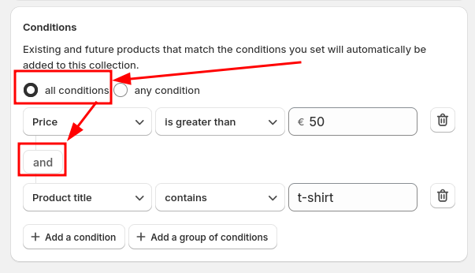
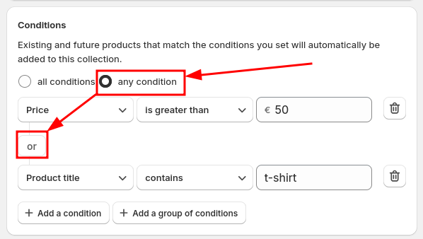
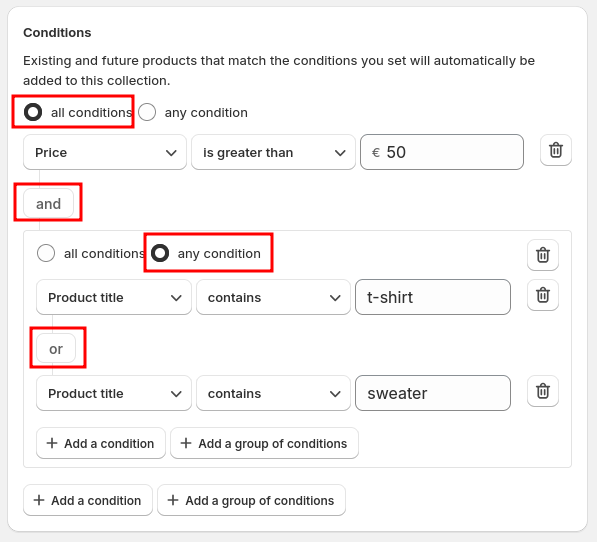

# Conditions & Product Filtering

When setting up a Managed Collection, you can define rules to automatically include or exclude products. This guide explains how to use **All Conditions**, **Any Condition**, and **Condition Grouping** to fine-tune your collections.

## Any Condition or All Conditions

When configuring conditions, you can choose between **All Conditions** or **Any Condition** to determine how products are filtered into your Managed Collection.

- **All Conditions**: Products must match **every rule** you set.
- **Any Condition**: Products must match **at least one rule** to be included.

For example, if you select **All Conditions** and set the rules:
- Title contains **"t-shirt"**
- Price is **greater than €50**

Only t-shirts priced over €50 will be added.

If you select **Any Condition**, a product needs to match **either** rule. This means a product will be included if it’s a t-shirt (regardless of price) or if its price is over €50 (regardless of the title).

## Grouping Conditions

Grouping conditions allow you to mix **All Conditions** and **Any Condition** within a single Managed Collection.

For example, let’s refine the previous scenario:
- Select **All Conditions**
  - First rule: **Price is greater than €50**
  - Create a **Condition Group** with **Any Condition** and set:
    - Title contains **"t-shirt"**
    - Title contains **"sweater"**

This setup ensures only **t-shirts or sweaters priced over €50** are included.

## Flexible and Powerful Filtering
With these options, you can create highly customized collections that fit any situation. Whether you need strict filtering or a more flexible approach, **Smart Collection Pro** gives you full control over your product organization.

