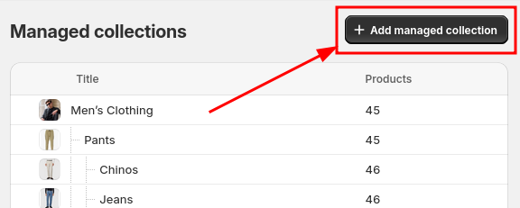
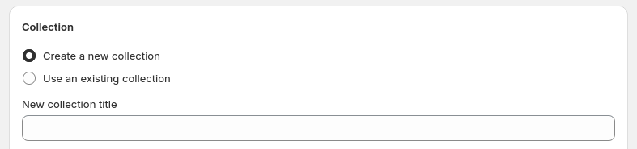
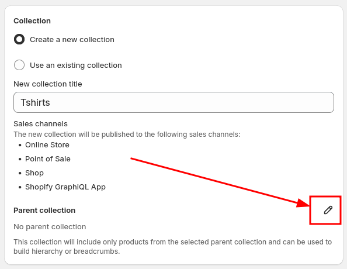
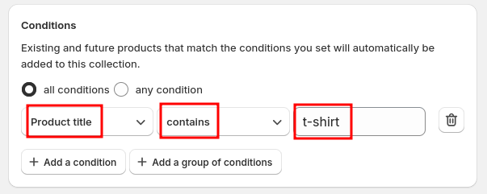
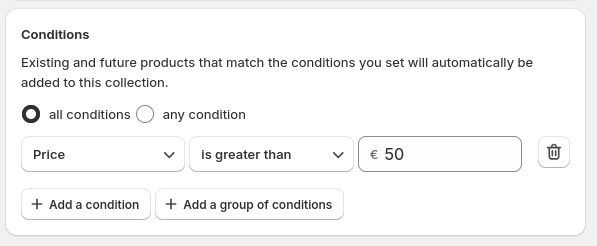

# Creating a Managed Collection

With **Smart Collection Pro**, you can create **Managed Collections**, which automatically manage a Shopify collection based on the conditions you configure. Products in these collections are dynamically updated, ensuring they always reflect the latest rules you’ve set.

## Adding a Managed Collection

To get started, click the **Add Managed Collection** button.

## Creating and Attaching to a Collection

you have two options:
- Option 1: **Create a new collection** and enter a name for your new collection. This will create a new collection in your store.
- Option 2: **Use an existing collection**. This will convert the collection you select into a Managed Collection..

:::warning
If you attach to an existing collection, products in this collection will be removed and replaced based on the configured conditions.
:::

## Nested Collections

You can assign a **parent collection** by clicking the **pen icon** next to the parent selection field.

When a Managed Collection has a parent, it becomes **nested**, inheriting products from the parent rather than filtering from the entire catalog. This allows for:
- **A structured hierarchy** that organizes collections more effectively.
- **Breadcrumb navigation**, making it easier for customers to explore your store.

If no parent is selected, the collection will filter products from the **entire catalog**.

## Configuring Conditions

The next step is to set up filtering conditions. For example, you can select all products where the title contains “t-shirt”.

When you select conditions, only products that match the defined criteria will be included in the collection. Any products that do not meet the conditions will be removed. For example, the condition below will ensure that only products with a price higher than €50 are included. Over time, if a product’s price changes, it will be automatically added or removed based on this rule.

To find more information on how to configure conditions [see the Guide on Conditions](#)

## Saving and Synchronization

Once you've configured your collection, click **Save**. Synchronization will then begin automatically.

### Synchronization Time
The time required for synchronization depends on:
1. **The size of your catalog** – Larger catalogs take longer to process.
2. **Your selected plan** – Higher-tier plans have priority and faster synchronization speeds.

Your Managed Collection is now set up and will update dynamically based on your configured rules!

