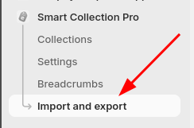

# CSV Import & Export

The **CSV Import & Export** feature is designed for merchants who need to migrate a collection hierarchy from one Shopify store to another. Instead of rebuilding your managed collections by hand in the destination store, you can export them as a CSV from the source store and import them into the new one.

This is an **opt-in only feature**, enabled on a per-merchant basis. If you need access, reach out to us and we'll enable it for your store.

Once enabled, a new **Import & Export** entry appears in the left menu of the app inside the Shopify Admin.



:::warning

Being an early-access feature. It has limited error coverage. If an import fails, it may do so with an unhelpful generic error message. If that happens, contact us with your CSV and we'll help diagnose what went wrong.

:::

---

## Exporting Collections

Exporting gives you a CSV snapshot of all your managed collections — their hierarchy, parent/child relationships, and filter conditions. The main use case is to then import that file into another store, but you can also use it as a reference when building a CSV by hand.

### How to Export

#### 1. Open the **Import & Export** section from the left menu

#### 2. Click **Export CSV**

The file downloads to your computer. Each row represents one managed collection.

> **Good to know:** The exported CSV contains additional columns (like internal IDs and Shopify resource IDs) that are not used during import. They're there to help you read and understand the file — you don't need to include them if you're building a CSV by hand.

---

## Importing Collections

Importing reads a CSV file and creates managed collections in the app, linking each one to an existing Shopify collection and wiring up the parent/child relationships. This is what you'd run in a destination store after exporting from the source.

### Before you import

:::danger

The import tool **does not create Shopify collections**. Every collection referenced in your CSV must already exist as a **manual (non-smart) collection** in the destination store before you run the import. If a collection doesn't exist yet, create it manually in Shopify first.

:::

The import only creates managed collections inside the app — it connects them to Shopify collections that already exist in your store, but never creates those collections itself.

For each row in the CSV, the import will:

- Create a managed collection in the app
- Link it to the existing Shopify collection via its handle
- Assign its parent based on `parent_collection_handle`
- Apply the filter conditions from the `filters` field

Each parent collection referenced in your CSV must either already be a managed collection in the app, or appear as its own row in the CSV so it gets created in the same import run.

### How to Import

#### 1. Open the **Import & Export** section from the left menu

#### 2. Click **Import CSV** and select your file

#### 3. Review the summary and confirm

The app will process the file and create the managed collections. If anything fails, contact us — we can help figure out what went wrong.

---

## CSV File Format

The CSV requires four columns. Any additional columns (like those present in an exported file) are ignored during import.

| Column                     | Description                                                                                                                                                                                                            |
| -------------------------- | ---------------------------------------------------------------------------------------------------------------------------------------------------------------------------------------------------------------------- |
| `collection_handle`        | The handle of the Shopify collection this row maps to. Must already exist as a manual (non-smart) collection in the store.                                                                                             |
| `collection_title`         | The title of the collection. Not used during import — only included to make error messages easier to read.                                                                                                             |
| `parent_collection_handle` | The handle of the parent collection. Leave empty for root collections. Must exist as a manual collection in the store, and must either already be a managed collection in the app or appear as its own row in the CSV. |
| `filters`                  | A JSON object defining the collection's filter conditions. See [The `filters` field](#the-filters-field) below.                                                                                                        |

### Simple example

Here's what a minimal CSV looks like for a two-level hierarchy — a **Women's Clothing** root collection with a **Dresses** child collection:

```csv
collection_handle,collection_title,parent_collection_handle,filters
womens-clothing,Women's Clothing,,"{""name"":""logicalGroup"",""operator"":""and"",""children"":[]}"
dresses,Dresses,womens-clothing,"{""name"":""logicalGroup"",""operator"":""and"",""children"":[]}"
```

`parent_collection_handle` is left empty for the root collection. `dresses` references `womens-clothing` as its parent, so the app will nest it underneath. The empty `children` array in the `filters` field means no filter conditions — the collection will include all products from its parent.

---

## The `filters` Field

The `filters` column is the most complex part of the CSV. It contains a JSON object that describes the conditions used to populate the collection — the same rules you'd configure using the visual condition builder in the app.

### Structure

Every `filters` value must be a `logicalGroup` at the top level. A `logicalGroup` has three properties:

- `"name": "logicalGroup"` — identifies it as a group node
- `"operator"` — either `"and"` or `"or"`, controlling how its children are evaluated together
- `"children"` — an array of individual filter conditions, or nested `logicalGroup` objects

Nesting `logicalGroup` objects inside `children` is how you replicate the sub-groups you can build in the visual editor — for example, an outer `or` group that contains an inner `and` group.

**Example** — include all discounted products:

```json
{
  "name": "logicalGroup",
  "operator": "or",
  "children": [
    {
      "name": "discount",
      "operator": "true",
      "value": null
    }
  ]
}
```

**Example** — combine a metafield condition with a price condition using nested groups:

```json
{
  "name": "logicalGroup",
  "operator": "or",
  "children": [
    {
      "name": "logicalGroup",
      "operator": "and",
      "children": [
        {
          "name": "gid://shopify/MetafieldDefinition/65827537127",
          "operator": "neq",
          "value": "8",
          "metafieldKey": "test_decimal_field",
          "metafieldName": "test decimal field",
          "metafieldTypeName": "number_decimal",
          "metafieldNamespace": "custom",
          "metafieldOwnerType": "PRODUCT"
        }
      ]
    },
    {
      "name": "price",
      "operator": "gt",
      "value": "0"
    }
  ]
}
```

### The easiest way to get the right JSON

The filter JSON format is not fully documented. Rather than writing it from scratch, the recommended approach is to **set up the conditions you want using the app's visual editor**, then export your collections and copy the `filters` value from the exported CSV. This guarantees the JSON is valid and correctly formatted.

---

## Converting Smart Collections to Manual Collections

The import tool only works with manual (non-smart) collections. If you're trying to migrate smart collections, you'll need to convert them first — Shopify doesn't currently offer a native way to do this. Many Shopify partners, including BazaarForge, have raised this limitation with Shopify. It's on their radar, but without any communicated timeline, so it's not something to plan around for now.

The only available path is to **delete the smart collection and recreate it as a manual collection**.

:::danger

Deleting a collection permanently removes all references to it — including placements in your theme and any metafield relationships. This cannot be undone. Be sure you understand the full impact before proceeding.

:::

We recommend testing your migration on a **dev store** first. Smart Collection Pro is free on dev stores, so you can safely run through the full export/import workflow before touching your live store.
