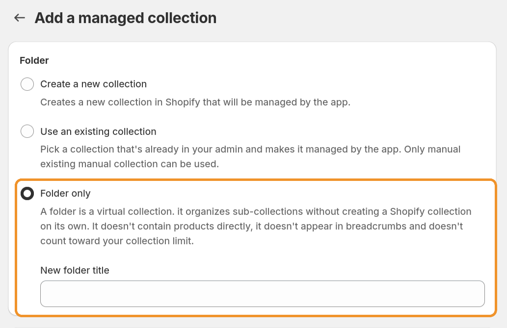

# Folders

## What is a Folder?

A folder is a way to group collections together without creating a Shopify collection. Think of it as a virtual container: it holds sub-collections, but it doesn't contain products on its own and it doesn't exist in Shopify's collection list.

This is useful when you want to organize your hierarchy at the top level without creating extra collections that show up in your storefront, in search results, or in Shopify's collections.

For example, say you have dozens of collections and want to group them by purpose to keep things manageable.
You could create folders like:

- 📁 **Seasonal Rotations**
- 📁 **Landing Pages**
- 📁 **Promotions**

to organize related collections together.
A Promotions folder might contain your Black Friday Deals, Cyber Monday Picks, and End of Season Sale collections.
The folders make your tree easier to navigate in the app,
but they don't create extra pages on your storefront that you'd then need to manage.

## How Folders Differ from Regular Collections

|                                     | Folder | Regular managed collection |
| ----------------------------------- | ------ | -------------------------- |
| Creates a Shopify collection        | No     | Yes                        |
| Contains products directly          | No     | Yes                        |
| Appears in breadcrumbs              | No     | Yes                        |
| Counts toward your collection limit | No     | Yes                        |
| Can have sub-collections            | Yes    | Yes                        |
| Can have filters                    | Yes    | Yes                        |
| Filters apply to sub-collections    | Yes    | Yes                        |

## Creating a Folder

#### 1. From the collection list, click **Create managed collection**

#### 2. Select **Folder** as the collection type

#### 3. Give your folder a name and optionally set up filters

Any filters you define on a folder will automatically apply to all of its sub-collections. This is a convenient way to set broad conditions once and have them cascade down.

#### 4. Save your folder

Your folder now appears in the collection list. You can start adding sub-collections to it right away, either by creating new ones or by editing existing collections to set the folder as their parent.

## Limitations

There are a few things to keep in mind when working with folders:

- **Folders can only be root collections.** You can't nest a folder inside another collection or another folder. They always sit at the top level of your hierarchy.
- **Folders don't appear in breadcrumbs.** Since they don't have a Shopify collection, the breadcrumb app block skips them and starts from the first real collection in the path.
- **Folders don't have a storefront page.** There's no URL to link to, because there's no Shopify collection behind them. If you need a landing page, use a regular managed collection instead.

## Folders and CSV Import/Export

Folders are fully supported in the CSV import and export workflow. When you export your collections, folders are included in the CSV with a special handle prefix: `scp.folder:`. For example, a folder named "Winter Sales" would appear as `scp.folder:winter-sales`.

You can use these prefixed handles in both the `collection_handle` and `parent_collection_handle` columns, just like a regular collection handle. Unlike regular collections, folders don't need to exist in Shopify before importing since they never create a Shopify collection.

For more details on the CSV format, see [CSV Import & Export](./csv-import.mdx).
