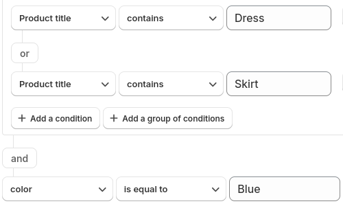
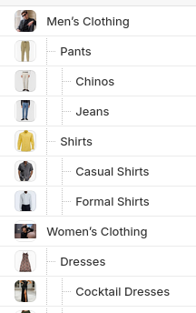
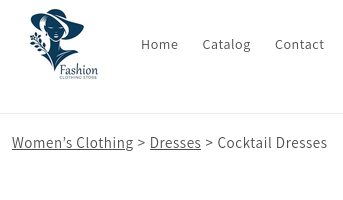

# Smart Collection Pro

This documentation will guide you through setting up and using Smart Collection Pro to enhance your Shopify collections with advanced conditions, auto-syncing, and more.

## What is Smart Collection Pro?

Smart Collection Pro is a shopify app that enhances the way you manage collections on Shopify. Unlike the standard smart collections, which have limited filtering options, Smart Collection Pro offers **advanced conditions** to create more dynamic and flexible collections that automatically update as your product catalog changes.

## Key Features
- **Advanced filtering** and **Auto-syncing** for more customized collections always up-to-date.
- **Nested collections** for hierarchical organization.
- **Breadcrumb navigation** support for easier store navigation.

### Advanced filtering

  

    

      
    

   

      Smart Collection Pro lets you automate collection **with advanced conditions**.
      You can mix and match blocks of filters to accommodate any situation—whether
      it’s narrowing down by multiple product attributes, excluding certain items,
      or combining rules for greater flexibility.

      For example, create a collection for **all products that are on sale and have a rating above 4 stars**,
      or include products that are either **in stock** or have a **specific tag**, but exclude those from a **particular brand**.
    

  

### Nested Hierarchy

  

      

        With Smart Collection Pro, you can **nest collections** to create a powerful **hierarchical structure**. This allows child collections to **inherit products** from their parent collection and filter them based on the parent’s rules, rather than the entire product catalog.

        For example, a parent collection like **"Summer Sale"** can include all products on sale, and a child collection like **"Beachwear"** can automatically filter products from the parent collection based on additional criteria—such as product type or tags.

        This hierarchical approach helps keep your collections organized and relevant, all while simplifying product management.
      

      

        
      

  

### Breadcrumb

  

      

        
      

      

        Smart Collection Pro lets you **add breadcrumbs** to your store, using your collection hierarchy. Once you configure your theme, breadcrumbs will dynamically reflect the parent-child relationships you've set up, providing a smooth navigation experience for your customers.

        For example, **Home > Summer Sale > Beachwear**. Simple to set up, and works seamlessly with your collections.
       

  

